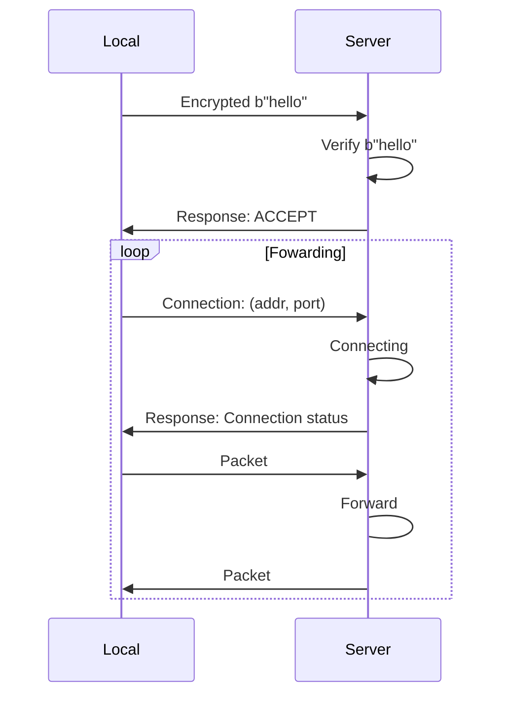

```mermaid
sequenceDiagram
	participant l as Local
	participant s as Server
	l ->> s: Encrypted b"hello"
	s ->> s: Verify b"hello"
	s ->> l: Response: ACCEPT
	loop Fowarding
		l ->> s: Connection: (addr, port)
		s ->> s: Connecting
		s ->> l: Response: Connection status
		l ->> s: Packet
		s -> s: Forward
		s ->> l: Packet
	end
```

​		