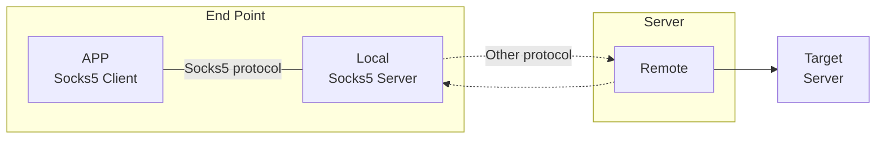

1. Shadowsocks 架构

```mermaid
graph LR
	subgraph End Point 
		client[APP<br>Socks5 Client] ---|Socks5 protocol| local[Local<br>Socks5 Server]
	end
	subgraph Server
		local -.->|Other protocol| remote[Remote]
		remote -.-> local
	end
	remote --> target[Target<br>Server]
	
```

